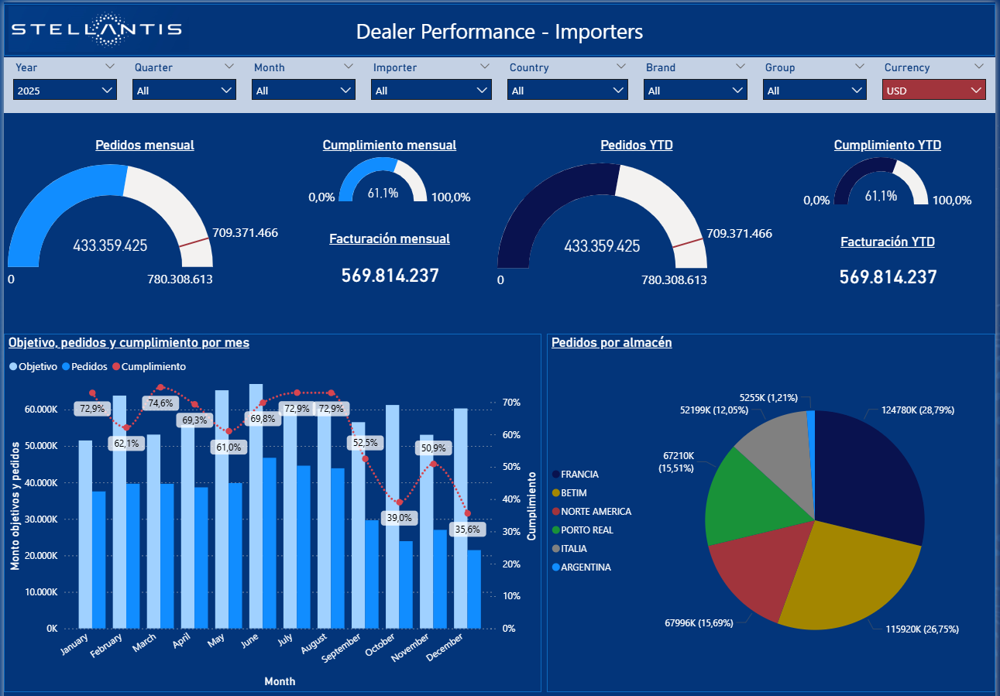
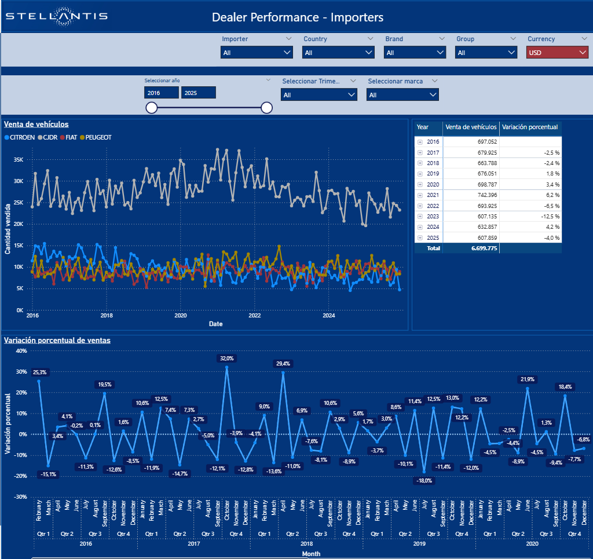
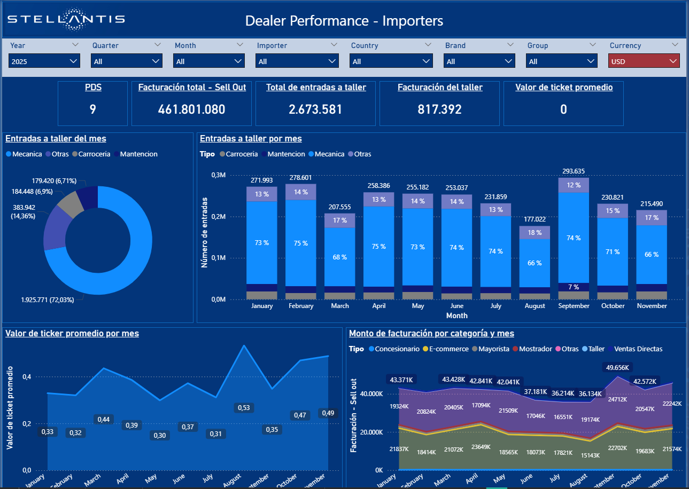

# Commercial Performance Dashboard – Power BI

This project showcases a Business Intelligence dashboard built in Power BI,
based on a real-world commercial monitoring solution.

## Dashboard Overview
- 5 interactive report pages
- Commercial KPIs: sales value, volume, and performance metrics
- Analysis by country, brand, importer, and product category
- Fully interactive filters and drill-down capabilities

## Data Source
The dashboard uses a fictitious dataset that replicates the structure and logic
of real ERP-derived commercial data.

The data was produced as the output of a Python-based ETL process
(see ETL project in this portfolio).

⚠️ No confidential or real business data is included.

## Tools & Skills
- Power BI Desktop
- Power Query (data transformation)
- Data modeling & KPI design
- Business Intelligence reporting

## Preview

